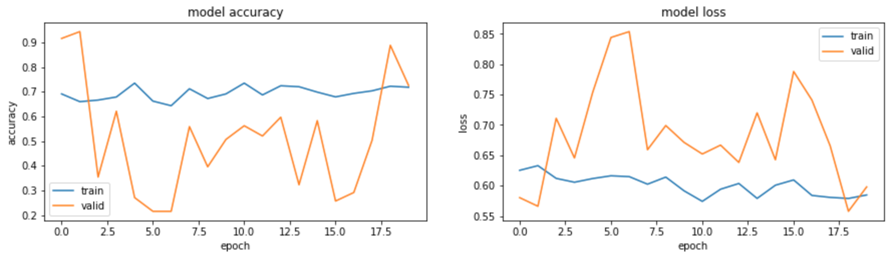
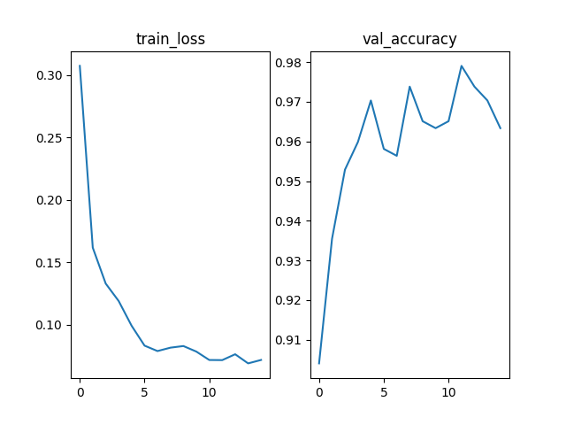
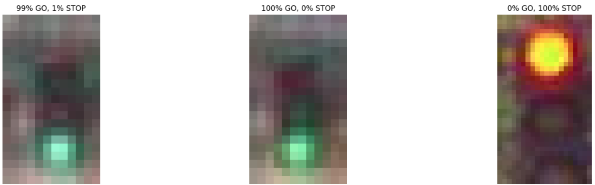
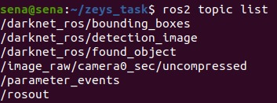
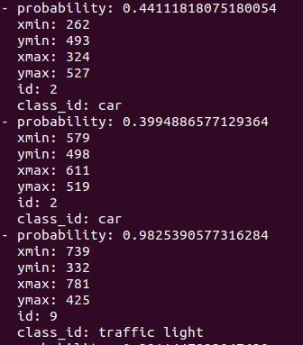
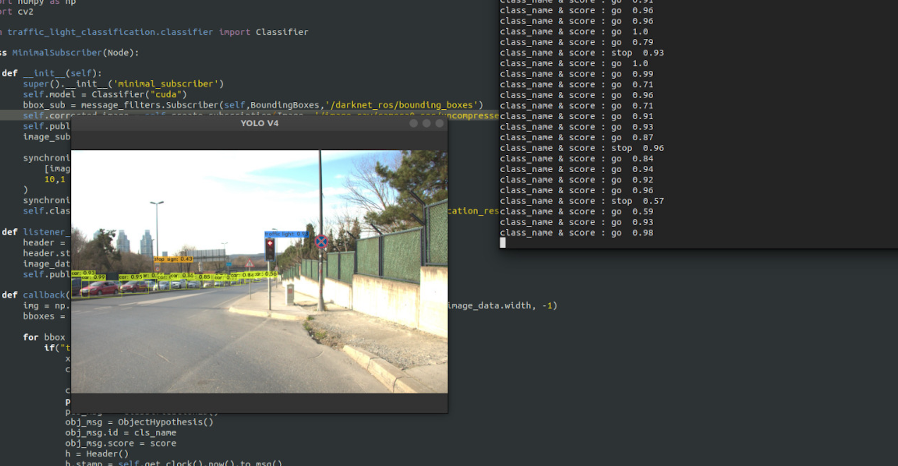

## OBJECT CLASSIFICATION BY ROS2

First step of this project was dataset downloading second step was dividing three part as train, test and  validation dataset images.
%70 of the dataset was train data , %20 of dataset was validation data and %10 of dataset was test data.
Pretrained Resnet-50 and VGG-16 models were trained for comparison purposes.
Here is results :

### RESNET-50

* Precision - Precision is the ratio of correctly predicted positive observations to the total predicted positive observations.

* Recall (Sensitivity) - Recall is the ratio of correctly predicted positive observations to the all observations in actual class.

* F1 score - F1 Score is the weighted average of Precision and Recall. 

Classification Report

                   precision    recall  f1-score   support
		
    go             0.98         0.72      0.83       241
    stop           0.83         0.99      0.90       335
		
    accuracy                              0.88       576
    macro avg      0.90      0.85         0.86       576
    weighted avg   0.89      0.88         0.87       576

RESNET-50 Accuracy and Loss Graphic

### VGG -16
Classification Report 

                precision    recall  f1-score   support

    go            0.95      0.80      0.97       241
    stop          0.90      0.97      0.92       335
		
    accuracy                          0.97       576
    macro avg     0.94      0.82      0.98       576
    weighted avg  0.90      0.90      0.98       576

 VGG-16 Accuracy and Loss Graphic

VGG-16 gave better result so it's picked to contunie of project.

### ROS2 STEPS
After ros2bag file these step below done. 
*       mkdir foxy_ws && cd foxy_ws #create workspace
*       mkdir src && cd src  #create source 
*       git clone ....  #clone darknet_ros repo
*      source /opt/ros/foxy/setup.bash  #Set up your environment by sourcing the following file.
*      rosdep install -i --from-path src --rosdistro foxy -y  #Install dependencies from src 
*      source install/setup.bash  #This script extends the environment with the environment of other prefix paths which were sourced when this file was generated as well as all packages contained in this prefix path.
*      colcon build #makes file as ros file
*      ros2 bag play ros_bag_file_name.bag #plays video in rosbag file

##### New Terminal
*      source /opt/ros/foxy/setup.bash
*      source install/setup.bash
*      ros2 launch darknet_ros yolov3.launch.py 

##### New Terminal
*     source /opt/ros/foxy/setup.bash  
*     source install/setup.bash
*     ros2 topic list  # to see published nodes inside packages
  
*     ros2 topic echo /darknet_ros/bounding_boxes # to see message inside of the node
    

### IMPORTANT !
The call back functions of the subscriber nodes I created were not working because they could not synchronize.After searching the internet. As a method, I learned that the metadata in the header, the time stamp, should be fixed.
For this, I fixed the time of the raw images in the classifier node and gave them to the message service.Then I produced results by inserting images into the model prediction and on a new publisher node. I published the name of classes and the scores of them.
Here is the result after solving simultaneous synchronization problem :

