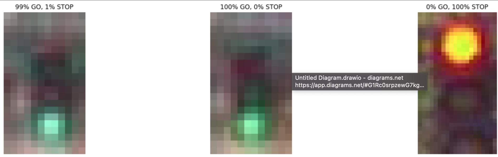

### OBJECT CLASSIFICATION BY ROS2

First step of this project dataset downloaded and divided three part as train test validation images.
%70 of the dataset is train data , %20 of dataset is validation data and %10 of dataset is test data.
Pretrained Resnet-50 and VGG-16 models were trained for comparison purposes.
VGG-16 gave better results than Resnet-50 
Here is results :

* #### RESNET-50
Resnet-50 Accuracy and Loss Graphic

* Precision - Precision is the ratio of correctly predicted positive observations to the total predicted positive observations.

* Recall (Sensitivity) - Recall is the ratio of correctly predicted positive observations to the all observations in actual class.

* F1 score - F1 Score is the weighted average of Precision and Recall. 

Classification Report

                   precision    recall  f1-score   support
		
    go             0.98         0.72      0.83       241
    stop           0.83         0.99      0.90       335
		
    accuracy                              0.88       576
    macro avg      0.90      0.85         0.86       576
    weighted avg   0.89      0.88         0.87       576

* ### VGG -16
 VGG-16 Accuracy and Loss Graphic

Classification Report 

                precision    recall  f1-score   support

    go            0.95      0.80      0.97       241
    stop          0.90      0.97      0.92       335
		
    accuracy                          0.97       576
    macro avg     0.94      0.82      0.98       576
    weighted avg  0.90      0.90      0.98       576

VGG-16 gave better result so it's picked to contunie of project.

### ROS2 STEPS

